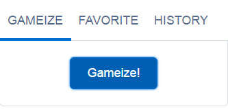
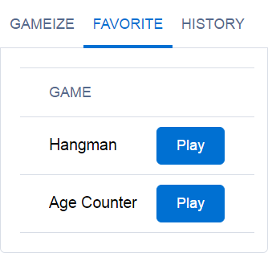
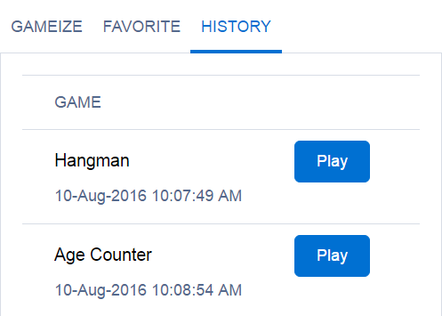
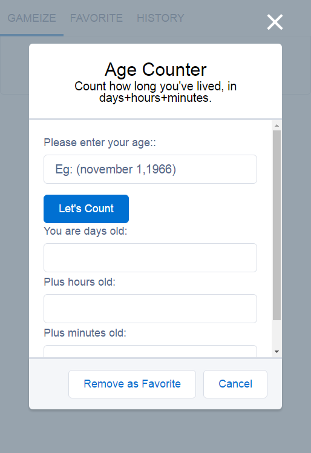

# Gameize
Gameize = Game Randomize

This component provides a collection of Javascript games which can be played randomly; for fun.

## Synopsis
Gameize is a collection of javascript games similar to http://www.javascriptkit.com/script/cutindex22.shtml, but converted to work in Lightning Components Framework. 
 
Idea is to allow users to take a break from work and have fun. Games are not graphic but rather old style text JS games (for now, others might eventually be added).  

 
  
  
  

## Installation

**Requirements**
<ul>
    <li>My Domain</li>
    <li>Allow Read/Create/Edit access on "Gameize" object after installation
        <ul>
            <li>Users need to upsert a record in this object to store their favorite games and history of played games</li>
        </ul>
    </li>
</ul>

## Usage ##
There are 2 ways to use this component. 
<ol>
    <li>You can use App Builder to add this component to a Lightning Page and/or tab. Or you can use latest App Builder feature to edit LEX home/record page and add the component there.</li>
    <li>You can also use this component programmatically and add it to your other components; as needed.
        <ul><li>&lt;Gameize:Gameize debug="false" maxHistoryItems="10" activeTabNumber="1" /&gt;</li></ul>
    </li>
</ol>

## Technical Details ##
Events:
<ol>
	<li>COMPONENT: <strong>Gamize_DataUpdated</strong>
	<ul>
		<li>This event is raised when a game is
		<ul>
			<li>Marked as favorite</li>
			<li>Stored in history when played</li>
		</ul>
		</li>
	</ul>
	</li>
	<li>COMPONENT: <strong>Gameize_ShowGame</strong>
	<ol>
		<li>This event is raised when
		<ol>
			<li>User selects a game from Favorite or History tab</li>
		</ol>
		</li>
		<li>Allows users to play their favorite game directly rather than having to click Gameize button and randomly finding it</li>
	</ol>
	</li>
</ol>

    

Components:
<ul>
	<li><strong>Gameize</strong>
	<ul>
		<li>Global Attributes
		<ul>
			<li><strong>debug</strong>: true/false: If true then display log with console.log or System.debug (in Apex)</li>
			<li><strong>maxHistoryItems</strong>: Number: Number of items to store in history; to keep object size to minimum. For example: Storing 10 history recods consume 1.2KB on average</li>
			<li><strong>activeTabNumber</strong>: By default it is 1 but you can also specify 2 or 3 if you want users to see Favorite or History tab on load</li>
		</ul>
		</li>
		<li>How it works
		<ul>
			<li>Gameize will fetch user favorite and history list on load; if available</li>
			<li>Gameize will also load list of games available
			<ul>
				<li>List of games is stored as a JSOn string in a Static Resource; to make it easy to update list of Games</li>
				<li>Each game corresponds to an acual component</li>
				<li>Each game component name is in &quot;Gameize_Game_[GAME]&quot; format</li>
			</ul>
			</li>
			<li>This component has 3 tabs which include 3 components
			<ul>
				<li>First tab, <strong>Gameize_Select</strong>,
				<ul>
					<li>This component has a &quot;Gameize&quot; button</li>
					<li>Clicking the button will randomly pick a game from available game list</li>
					<li>Selected game will be displayed to user in Modal dialog using CreateComponent Lightning Component function</li>
					<li>When a game is selected, it will be stored as History</li>
					<li>When a game dialog is open, users can add/remove a game as Favorite</li>
				</ul>
				</li>
				<li>Second tab, <strong>Gameize_Favorite</strong>,
				<ul>
					<li>Displays a DataTable of all games user has marked as favorite</li>
					<li>Each game has a &quot;Play&quot; button to allow users to directly play that game instead of click &quot;Gameize&quot; button randomly and play it</li>
				</ul>
				</li>
				<li>Third tab, <strong>Gameize_History</strong>,
				<ul>
					<li>Displays a DataTable of all games user has played; upto maximum allowed list</li>
					<li>Each game has a &quot;Play&quot; button to allow users to directly play that game instead of click &quot;Gameize&quot; button randomly and play it</li>
				</ul>
				</li>
			</ul>
			</li>
		</ul>
		</li>
	</ul>
	</li>
</ul>

## Credits
Following are some of the component/libraries that I have used in this component. 

<ol>
    <li>ETLC_ApexBridge
        <ol>
            <li>https://eltoro.secure.force.com/ETLC_ApexBridge</li>
            <li>http://github.com/eltoroit/ETLC_ApexBridge</li>
        </ol>
    </li>
</ol>

## About Me
I, Jaswinder Rattanpal,  love to work on new things. This time, I tried my hands at creating a new Lightning Component to publish on App Exchange.

I am also an Associate Technical Evangelist working with ISV Technical Evangelists team @Salesforce.

Don't forget to visit my blog: http://www.rattanpal.com